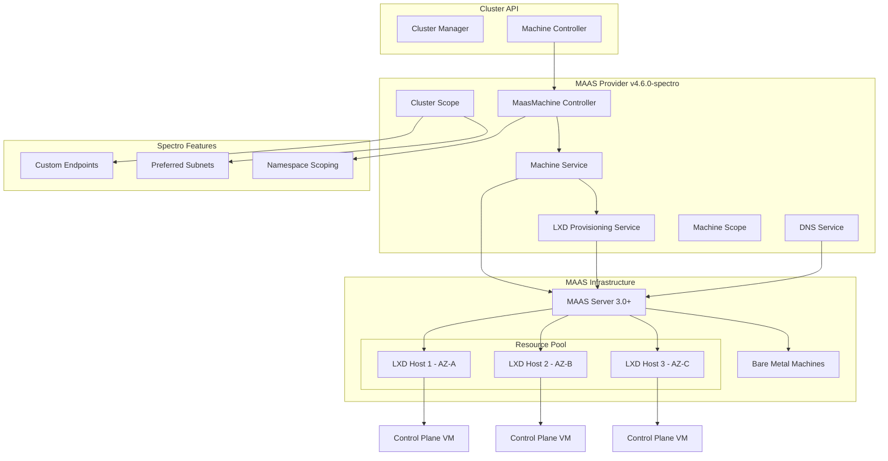

# Design Document: LXD Control Plane Provisioning

## Overview

This design extends the cluster-api-provider-maas v4.6.0-spectro to support dynamic provisioning of LXD virtual machines for control plane nodes. The enhancement integrates with MAAS 3.0+ LXD VM capabilities while maintaining backward compatibility with bare metal provisioning and preserving all existing Spectro-specific features including custom endpoints, preferred subnets, and enhanced namespace support.

## Architecture

### High-Level Architecture



### Component Integration

The design extends the existing v4.6.0-spectro architecture by:

1. **Extending MaasMachineSpec**: Adding `provisioningMode` and LXD-specific configuration
2. **Enhancing Machine Service**: Adding LXD VM provisioning alongside existing bare metal logic
3. **New LXD Provisioning Service**: Dedicated service following existing service patterns
4. **Preserving Spectro Features**: Maintaining custom endpoints, preferred subnets, and namespace scoping

## Components and Interfaces

### 1. Extended MaasMachine API (api/v1beta1/maasmachine_types.go)

```go
// MaasMachineSpec defines the desired state of MaasMachine
type MaasMachineSpec struct {
    // Existing fields
    FailureDomain *string `json:"failureDomain,omitempty"`
    SystemID      *string `json:"systemID,omitempty"`
    ProviderID    *string `json:"providerID,omitempty"`
    ResourcePool  *string `json:"resourcePool,omitempty"`
    MinCPU        *int    `json:"minCPU"`
    MinMemoryInMB *int    `json:"minMemory"`
    Tags          []string `json:"tags,omitempty"`
    Image         string   `json:"image"`
    
    // New LXD-specific fields
    ProvisioningMode *ProvisioningMode `json:"provisioningMode,omitempty"`
    LXDConfig        *LXDConfig        `json:"lxdConfig,omitempty"`
}

type ProvisioningMode string

const (
    ProvisioningModeBareMetal ProvisioningMode = "bare-metal"
    ProvisioningModeLXD       ProvisioningMode = "lxd"
)

type LXDConfig struct {
    Profile     *string            `json:"profile,omitempty"`
    Storage     *LXDStorageConfig  `json:"storage,omitempty"`
    Network     *LXDNetworkConfig  `json:"network,omitempty"`
    VMHost      *string            `json:"vmHost,omitempty"`
    Project     *string            `json:"project,omitempty"`
}

type LXDStorageConfig struct {
    Size string `json:"size"`
    Pool string `json:"pool,omitempty"`
}

type LXDNetworkConfig struct {
    Bridge  string   `json:"bridge,omitempty"`
    Devices []string `json:"devices,omitempty"`
}
```

### 2. Extended MaasMachine Status

```go
type MaasMachineStatus struct {
    // Existing fields
    Ready             bool                     `json:"ready"`
    MachineState      *MachineState            `json:"machineState,omitempty"`
    MachinePowered    bool                     `json:"machinePowered,omitempty"`
    Hostname          *string                  `json:"hostname,omitempty"`
    DNSAttached       bool                     `json:"dnsAttached,omitempty"`
    Addresses         []clusterv1.MachineAddress `json:"addresses,omitempty"`
    Conditions        clusterv1.Conditions     `json:"conditions,omitempty"`
    FailureReason     *errors.MachineStatusError `json:"failureReason,omitempty"`
    FailureMessage    *string                  `json:"failureMessage,omitempty"`
    
    // New LXD-specific fields
    ProvisioningMode  *ProvisioningMode        `json:"provisioningMode,omitempty"`
    LXDHost           *string                  `json:"lxdHost,omitempty"`
    LXDProject        *string                  `json:"lxdProject,omitempty"`
    VMResourceUsage   *VMResourceUsage         `json:"vmResourceUsage,omitempty"`
}

type VMResourceUsage struct {
    AllocatedCores  int `json:"allocatedCores"`
    AllocatedMemory int `json:"allocatedMemory"` // MB
    AllocatedDisk   int `json:"allocatedDisk"`   // GB
}
```

### 3. LXD Provisioning Service Interface (pkg/maas/lxd/service.go)

Following the existing service patterns in the codebase:

```go
type Service struct {
    scope      *scope.MachineScope
    maasClient maasclient.ClientSet
}

func NewService(machineScope *scope.MachineScope) *Service {
    return &Service{
        scope:      machineScope,
        maasClient: scope.NewMaasClient(machineScope.ClusterScope),
    }
}

// LXD VM lifecycle operations following existing machine service patterns
func (s *Service) ComposeVM(ctx context.Context, vmSpec *VMSpec) (*LXDVMResult, error)
func (s *Service) DeployVM(ctx context.Context, systemID, userDataB64 string) (*infrav1beta1.Machine, error)
func (s *Service) GetVM(ctx context.Context, systemID string) (*infrav1beta1.Machine, error)
func (s *Service) DeleteVM(ctx context.Context, systemID string) error

// Host selection following existing resource constraint patterns
func (s *Service) GetAvailableLXDHosts(ctx context.Context) ([]LXDHost, error)
func (s *Service) SelectOptimalHost(ctx context.Context, hosts []LXDHost) (*LXDHost, error)
func (s *Service) DistributeAcrossAZs(ctx context.Context, hosts []LXDHost, count int) ([]LXDHost, error)

type VMSpec struct {
    Cores       int
    Memory      int // MB
    Disks       []DiskSpec
    Profile     string
    Project     string
    UserData    string
    HostID      string
    Tags        []string
}

type LXDVMResult struct {
    SystemID      string
    HostID        string
    ProviderID    string
    FailureDomain string
    IPAddresses   []string
    Project       string
}

type LXDHost struct {
    SystemID         string
    Hostname         string
    AvailabilityZone string
    ResourcePool     string
    Available        ResourceInfo
    Used             ResourceInfo
    LXDCapabilities  LXDCapabilities
}

type ResourceInfo struct {
    Cores  int
    Memory int // MB
    Disk   int // GB
}

type LXDCapabilities struct {
    VMSupport      bool
    Projects       []string
    Profiles       []string
    StoragePools   []string
    NetworkBridges []string
}
```

### 4. Enhanced Machine Service (pkg/maas/machine/machine.go)

Extending the existing `Service` struct and methods:

```go
// Extend existing DeployMachine method
func (s *Service) DeployMachine(userDataB64 string) (*infrav1beta1.Machine, error) {
    mm := s.scope.MaasMachine
    
    // Determine provisioning mode
    provisioningMode := ProvisioningModeBareMetal
    if mm.Spec.ProvisioningMode != nil {
        provisioningMode = *mm.Spec.ProvisioningMode
    }
    
    switch provisioningMode {
    case ProvisioningModeLXD:
        return s.deployLXDVM(userDataB64)
    case ProvisioningModeBareMetal:
        fallthrough
    default:
        return s.deployBareMetal(userDataB64) // existing logic
    }
}

// New LXD VM deployment method
func (s *Service) deployLXDVM(userDataB64 string) (*infrav1beta1.Machine, error) {
    lxdService := lxd.NewService(s.scope)
    
    // Build VM specification
    vmSpec := s.buildVMSpec(userDataB64)
    
    // Compose and deploy VM
    result, err := lxdService.ComposeVM(context.TODO(), vmSpec)
    if err != nil {
        return nil, errors.Wrap(err, "failed to compose LXD VM")
    }
    
    // Deploy VM with user data
    return lxdService.DeployVM(context.TODO(), result.SystemID, userDataB64)
}
```

## Data Models

### 1. LXD Host Discovery Integration

Following existing MAAS client patterns:

```go
// Extend existing machine queries to identify LXD hosts
func (s *Service) GetAvailableLXDHosts(ctx context.Context) ([]LXDHost, error) {
    // Use existing resource pool filtering if specified
    resourcePool := s.scope.MaasMachine.Spec.ResourcePool
    failureDomain := s.scope.GetFailureDomain()
    tags := s.scope.MaasMachine.Spec.Tags
    
    // Query MAAS for VM hosts (LXD-capable machines)
    vmHosts, err := s.maasClient.VMHosts().List(ctx, 
        maasclient.ParamsBuilder().
            Set("type", "lxd").
            SetIfNotEmpty("zone", failureDomain).
            SetIfNotEmpty("pool", resourcePool))
    
    if err != nil {
        return nil, errors.Wrap(err, "failed to list LXD VM hosts")
    }
    
    return s.convertToLXDHosts(vmHosts, tags), nil
}
```

### 2. Provider ID Extension

Maintaining existing provider ID format while distinguishing LXD VMs:

```go
// Extend existing provider ID generation
func (s *MachineScope) GetProviderID() string {
    if s.MaasMachine.Spec.ProviderID != nil {
        return *s.MaasMachine.Spec.ProviderID
    }
    
    systemID := s.GetMachineSystemID()
    failureDomain := s.GetFailureDomain()
    
    // Distinguish LXD VMs in provider ID
    if s.IsLXDProvisioning() {
        return fmt.Sprintf("maas-lxd://%s/%s", failureDomain, systemID)
    }
    
    // Existing bare metal format
    return fmt.Sprintf("maas://%s/%s", failureDomain, systemID)
}

func (s *MachineScope) IsLXDProvisioning() bool {
    return s.MaasMachine.Spec.ProvisioningMode != nil && 
           *s.MaasMachine.Spec.ProvisioningMode == ProvisioningModeLXD
}
```

## Error Handling

### 1. LXD-Specific Error Types (pkg/maas/lxd/errors.go)

```go
type LXDError struct {
    Type     LXDErrorType `json:"type"`
    Message  string       `json:"message"`
    HostID   string       `json:"hostId,omitempty"`
    Details  interface{}  `json:"details,omitempty"`
}

type LXDErrorType string

const (
    LXDErrorHostUnavailable      LXDErrorType = "HostUnavailable"
    LXDErrorInsufficientResources LXDErrorType = "InsufficientResources"
    LXDErrorProfileNotFound      LXDErrorType = "ProfileNotFound"
    LXDErrorProjectNotFound      LXDErrorType = "ProjectNotFound"
    LXDErrorVMCreationFailed     LXDErrorType = "VMCreationFailed"
    LXDErrorVMDeploymentFailed   LXDErrorType = "VMDeploymentFailed"
)

func (e *LXDError) Error() string {
    return fmt.Sprintf("LXD %s: %s", e.Type, e.Message)
}
```

### 2. Integration with Existing Error Handling

Following existing patterns in `controllers/maasmachine_controller.go`:

```go
// Extend existing reconcileNormal method
func (r *MaasMachineReconciler) reconcileNormal(machineScope *scope.MachineScope, clusterScope *scope.ClusterScope) (ctrl.Result, error) {
    // ... existing logic ...
    
    // Enhanced error handling for LXD operations
    if machineScope.IsLXDProvisioning() {
        return r.reconcileLXDVM(machineScope, clusterScope)
    }
    
    return r.reconcileBareMetal(machineScope, clusterScope) // existing logic
}

func (r *MaasMachineReconciler) reconcileLXDVM(machineScope *scope.MachineScope, clusterScope *scope.ClusterScope) (ctrl.Result, error) {
    // LXD-specific reconciliation with existing error patterns
    if err := r.deployLXDVM(machineScope); err != nil {
        if isRetryableError(err) {
            // Use existing requeue patterns
            return ctrl.Result{RequeueAfter: 30 * time.Second}, nil
        }
        
        // Set failure conditions using existing patterns
        conditions.MarkFalse(machineScope.MaasMachine, 
            infrav1beta1.MachineDeployedCondition,
            infrav1beta1.MachineDeploymentFailedReason,
            clusterv1.ConditionSeverityWarning, 
            "LXD VM deployment failed: %v", err)
        
        return ctrl.Result{}, err
    }
    
    return ctrl.Result{}, nil
}
```

### 3. New Condition Types

Adding LXD-specific conditions while maintaining existing patterns:

```go
// Add to api/v1beta1/condition_consts.go
const (
    // Existing conditions
    MachineDeployedCondition = "MachineDeployed"
    DNSAttachedCondition     = "DNSAttached"
    
    // New LXD-specific conditions
    LXDHostSelectedCondition     = "LXDHostSelected"
    LXDVMCreatedCondition        = "LXDVMCreated"
    LXDVMDeployedCondition       = "LXDVMDeployed"
    LXDResourcesAllocatedCondition = "LXDResourcesAllocated"
)
```

## Integration with Spectro Features

### 1. Custom Endpoints Integration

LXD VMs will respect existing custom endpoint logic:

```go
// In pkg/maas/scope/cluster.go - no changes needed
func (s *ClusterScope) IsCustomEndpoint() bool {
    if infrautil.IsCustomEndpointPresent(s.MaasCluster.GetAnnotations()) {
        s.GetDNSName()
        s.V(0).Info("custom dns is provided skipping dns reconcile", "dns", s.GetDNSName())
        return true
    }
    return false
}
```

### 2. Preferred Subnets Integration

LXD VMs will use existing preferred subnet logic for DNS attachment:

```go
// In controllers/maascluster_controller.go - leverages existing logic
func getExternalMachineIP(log logr.Logger, preferredSubnets []string, machine *infrav1beta1.MaasMachine) string {
    // Existing logic works for both bare metal and LXD VMs
    for _, i := range machine.Status.Addresses {
        if i.Type == clusterv1.MachineExternalIP && addressInPreferredSubnets(log, preferredSubnets, i.Address) {
            return i.Address
        }
    }
    return ""
}
```

### 3. Namespace Scoping Integration

LXD operations will respect existing namespace boundaries through existing scope mechanisms.

## Testing Strategy

### 1. Unit Testing

**LXD Service Tests**:
- Host selection with resource constraints
- AZ distribution algorithms  
- VM lifecycle operations
- Error handling scenarios
- Integration with existing MAAS client patterns

**Controller Tests**:
- MaasMachine reconciliation with LXD mode
- Backward compatibility with bare metal mode
- Error recovery and retry logic
- Condition reporting
- Integration with Spectro features

### 2. Integration Testing

**MAAS Integration**:
- Real LXD host discovery and selection
- VM creation and deployment via MAAS API
- Resource pool and failure domain handling
- Mixed bare metal and LXD deployments

**Spectro Feature Integration**:
- Custom endpoints with LXD VMs
- Preferred subnets with LXD VMs  
- Namespace-scoped controllers
- DNS attachment and management

### 3. End-to-End Testing

**Control Plane Scenarios**:
- Single LXD VM control plane
- Multi-node LXD control plane across AZs
- Mixed bare metal and LXD control planes
- High availability failover scenarios

## Implementation Phases

### Phase 1: Core API Extension
- Extend MaasMachineSpec with provisioning mode
- Add LXD configuration types
- Update API validation and defaulting
- Generate updated CRDs

### Phase 2: LXD Service Implementation  
- Implement LXD provisioning service
- Add host discovery and selection logic
- Implement VM lifecycle management
- Add comprehensive error handling

### Phase 3: Controller Integration
- Extend MaasMachine controller for LXD support
- Integrate with existing reconciliation loops
- Add LXD-specific condition reporting
- Maintain backward compatibility

### Phase 4: Spectro Feature Integration
- Verify custom endpoint compatibility
- Test preferred subnet integration
- Validate namespace scoping
- Ensure DNS management works with LXD VMs

This design maintains full backward compatibility while adding LXD VM capabilities that integrate seamlessly with all existing Spectro-specific enhancements.