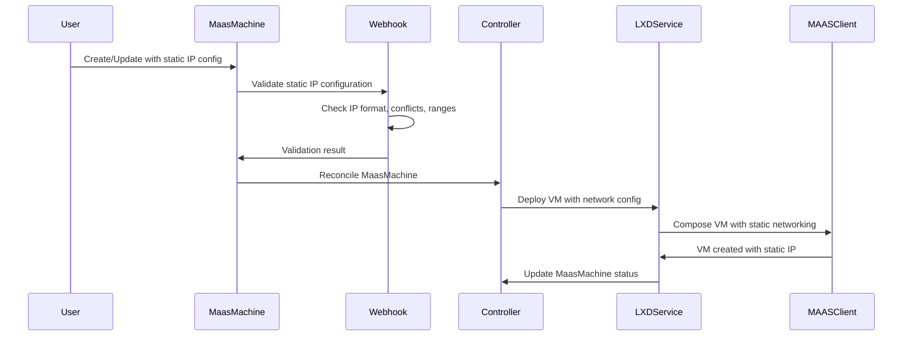
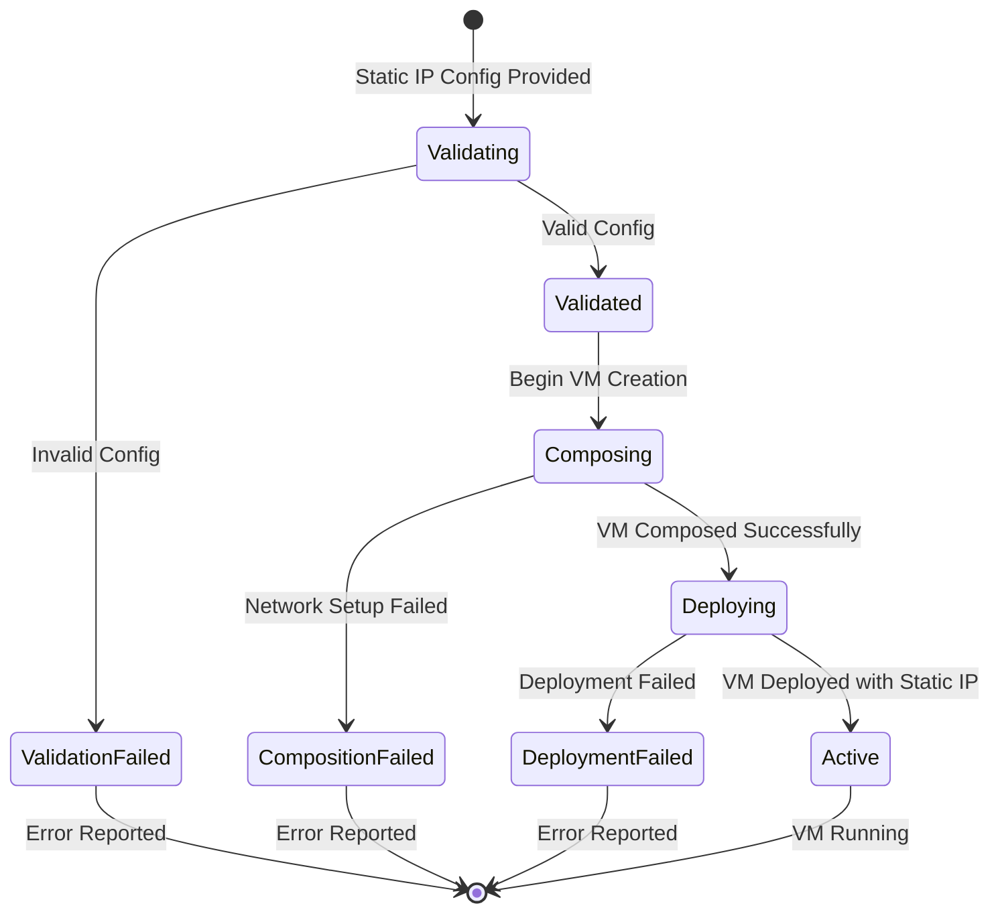

# Design Document: LXD Static IP Assignment

## Overview

This design extends the existing LXD VM provisioning feature in the cluster-api-provider-maas to support static IP assignment for LXD virtual machines. The solution integrates with the current `LXDNetworkConfig` structure and leverages MAAS networking capabilities to assign and validate static IP addresses before VM creation.

The design maintains backward compatibility with existing DHCP-based workflows while providing a declarative API for static IP configuration through the MaasMachine custom resource.

## Architecture

### High-Level Flow



### Component Integration

The static IP feature integrates with existing components:

1. **API Layer**: Extends `LXDNetworkConfig` in `maasmachine_types.go`
2. **Validation Layer**: Enhances webhook validation in `maasmachine_webhook.go`
3. **Service Layer**: Updates LXD service to handle static networking
4. **Client Layer**: Extends MAAS client to support static IP assignment
5. **Controller Layer**: Updates status reporting for network configuration

## Components and Interfaces

### API Extensions

**Extended LXDNetworkConfig Structure:**

```go
type LXDNetworkConfig struct {
    // Existing fields
    Bridge *string `json:"bridge,omitempty"`
    MacAddress *string `json:"macAddress,omitempty"`
    
    // New static IP fields
    StaticIPConfig *LXDStaticIPConfig `json:"staticIPConfig,omitempty"`
}

type LXDStaticIPConfig struct {
    IPAddress string `json:"ipAddress"`
    Gateway   string `json:"gateway"`
    Subnet    string `json:"subnet"`
    DNSServers []string `json:"dnsServers,omitempty"`
    Interface  *string `json:"interface,omitempty"`
}
```

**Status Reporting:**

```go
type LXDMachineStatus struct {
    // Existing fields
    HostSystemID *string `json:"hostSystemID,omitempty"`
    VMName       *string `json:"vmName,omitempty"`
    HostAddress  *string `json:"hostAddress,omitempty"`
    
    // New network status
    NetworkStatus *LXDNetworkStatus `json:"networkStatus,omitempty"`
}

type LXDNetworkStatus struct {
    AssignedIP    *string  `json:"assignedIP,omitempty"`
    Interface     *string  `json:"interface,omitempty"`
    ConfigMethod  string   `json:"configMethod"` // "dhcp" or "static"
    Gateway       *string  `json:"gateway,omitempty"`
    DNSServers    []string `json:"dnsServers,omitempty"`
}
```

### Validation Logic

**Webhook Validation Extensions:**

1. **IP Address Validation**: 
   - Valid IPv4/IPv6 format
   - Within allowed CIDR ranges
   - Not in reserved ranges

2. **Conflict Detection**:
   - Check against existing MaasMachine static IPs
   - Validate against MAAS IPAM if available
   - Ensure gateway reachability

3. **Network Configuration Validation**:
   - Subnet mask/CIDR format validation
   - DNS server IP format validation
   - Interface name validation

### Service Layer Changes

**LXD Service Extensions:**

```go
type VMSpec struct {
    // Existing fields
    Cores    int
    Memory   int
    Disks    []DiskSpec
    Profile  string
    Project  string
    UserData string
    HostID   string
    Tags     []string
    
    // New network configuration
    NetworkConfig *VMNetworkConfig
}

type VMNetworkConfig struct {
    Bridge         *string
    MacAddress     *string
    StaticIPConfig *StaticIPSpec
}

type StaticIPSpec struct {
    IPAddress  string
    Gateway    string
    Subnet     string
    DNSServers []string
    Interface  string
}
```

**Service Methods:**

- `buildVMSpec()`: Enhanced to include static IP configuration
- `composeVM()`: Extended to pass network configuration to MAAS
- `validateNetworkConfig()`: New method for pre-deployment validation

### Client Layer Extensions

**MAAS Client Integration:**

```go
type ComposeVMParams struct {
    // Existing fields
    VMHostID    string
    Cores       int
    Memory      int
    Storage     []StorageSpec
    
    // New network parameters
    NetworkConfig *NetworkConfigParams
}

type NetworkConfigParams struct {
    Interfaces []InterfaceConfig
}

type InterfaceConfig struct {
    Name       string
    Bridge     *string
    MacAddress *string
    IPConfig   *StaticIPParams
}

type StaticIPParams struct {
    IPAddress  string
    Gateway    string
    Subnet     string
    DNSServers []string
}
```

## Data Models

### Configuration Model

Static IP configuration follows a hierarchical model:

1. **MaasMachine Spec** contains optional `LXDConfig.NetworkConfig.StaticIPConfig`
2. **Validation** ensures configuration consistency and conflict avoidance
3. **Service Layer** transforms API config into MAAS client parameters
4. **Status** reflects the actual network configuration after deployment

### State Management



### IP Address Management

- **Conflict Prevention**: Webhook validates against existing allocations
- **Range Validation**: Ensures IPs are within allowed subnets
- **Gateway Validation**: Verifies gateway accessibility from assigned IP
- **Status Tracking**: Records actual assigned configuration in status

## Error Handling

### Validation Errors

1. **Invalid IP Format**: 
   - Error: "Invalid IP address format: {ip}"
   - Action: Reject MaasMachine creation/update

2. **IP Conflict**:
   - Error: "IP address {ip} is already in use by machine {name}"
   - Action: Reject MaasMachine creation/update

3. **Invalid Subnet**:
   - Error: "IP address {ip} is not within allowed subnet {subnet}"
   - Action: Reject MaasMachine creation/update

### Runtime Errors

1. **Network Configuration Failure**:
   - Condition: `NetworkConfigurationFailed`
   - Reason: `StaticIPAssignmentFailed`
   - Message: Specific error from MAAS/LXD

2. **Gateway Unreachable**:
   - Condition: `NetworkConfigurationFailed`
   - Reason: `GatewayUnreachable`
   - Message: "Gateway {gateway} is not reachable from {ip}"

### Error Recovery

- **Validation Errors**: Require user intervention to fix configuration
- **Network Failures**: Automatic retry with exponential backoff
- **MAAS API Errors**: Surface specific MAAS error messages to user

## Testing Strategy

### Unit Tests

1. **API Validation Tests**:
   - Valid static IP configuration acceptance
   - Invalid IP format rejection
   - Missing required field handling
   - Boundary condition testing

2. **Service Layer Tests**:
   - VMSpec building with static IP configuration
   - Network configuration parameter transformation
   - Error handling and status updates

3. **Client Integration Tests**:
   - MAAS client parameter building
   - Response parsing and status extraction
   - Error condition handling

### Integration Tests

1. **Webhook Validation**:
   - End-to-end validation of MaasMachine creation
   - Conflict detection across multiple machines
   - Update scenario validation

2. **Controller Integration**:
   - Full reconciliation loop with static IP
   - Status update verification
   - Error condition propagation

3. **LXD Service Integration**:
   - VM creation with static networking
   - Network configuration application
   - Status reporting accuracy

### Compatibility Tests

1. **Backward Compatibility**:
   - Existing DHCP-based workflows continue working
   - No breaking changes to existing API
   - Migration path validation

2. **Mixed Environment**:
   - DHCP and static IP VMs in same cluster
   - Resource pool and zone distribution
   - Network isolation verification

### Performance Tests

1. **Validation Performance**:
   - Large-scale IP conflict checking
   - Webhook response time with many machines
   - Memory usage during validation

2. **Provisioning Performance**:
   - Static IP assignment time vs DHCP
   - Concurrent VM creation with static IPs
   - Resource contention handling