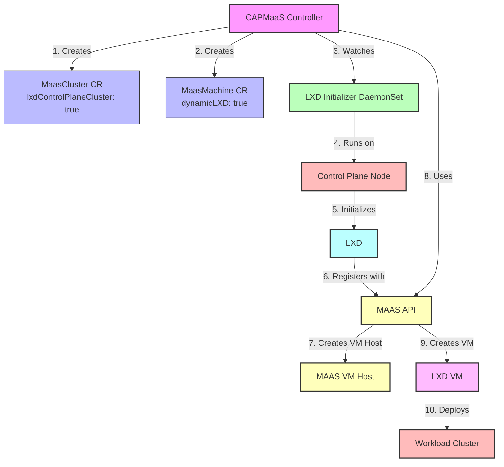

# Integrating LXD Initializer DaemonSet with CAPMaaS

This document describes how to integrate the LXD initializer DaemonSet with the Cluster API Provider for MAAS (CAPMaaS).

## Overview

The LXD initializer DaemonSet is a solution for initializing LXD on nodes and registering them with MAAS as VM hosts. This approach solves several challenges:

1. **No direct access required**: The CAPMaaS controller doesn't need direct access to the LXD socket on each node.
2. **Proper initialization**: LXD is initialized locally on each node by the DaemonSet.
3. **Automatic registration**: Each node is automatically registered with MAAS as a VM host.
4. **Scalability**: Works correctly in a distributed environment.

## Architecture

The architecture of the integrated solution is as follows:



1. **CAPMaaS Controller**: The CAPMaaS controller creates and manages MaasCluster and MaasMachine resources.
2. **LXD Initializer DaemonSet**: The DaemonSet runs on each node and initializes LXD, then registers the node with MAAS as a VM host.
3. **MAAS**: MAAS manages the VM hosts and VMs.
4. **LXD**: LXD runs on each node and manages the VMs.

## Integration Steps

### 1. Build and Deploy the LXD Initializer DaemonSet

First, build and deploy the LXD initializer DaemonSet:

```bash
# Build the LXD initializer
cd lxd-initializer
make build

# Build and push the Docker image
make docker-push REGISTRY=<your-registry> TAG=<your-tag>

# Update the DaemonSet manifest with your registry and tag
sed -i 's/${REGISTRY}/<your-registry>/g' lxd-initializer-daemonset.yaml
sed -i 's/${TAG}/<your-tag>/g' lxd-initializer-daemonset.yaml

# Apply the DaemonSet manifest
kubectl apply -f lxd-initializer-daemonset.yaml
```

### 2. Configure CAPMaaS to Use the DaemonSet

Update the CAPMaaS controller to use the DaemonSet for LXD initialization:

1. The `pkg/maas/lxd/host.go` file has been updated to only check if a host is registered with MAAS and register it if not. It no longer attempts to initialize LXD directly.
2. The `pkg/maas/lxd/service.go` file has been updated to use the DaemonSet for LXD initialization.
3. The `pkg/maas/vmhosts/vmhosts.go` file has been updated to include methods for VM host management.

### 3. Configure MAAS Credentials

Create a Secret and ConfigMap for MAAS credentials:

```bash
# Create a Secret for MAAS API key
kubectl create secret generic maas-credentials \
  --namespace capmaas-system \
  --from-literal=apiKey="<your-maas-api-key>"

# Create a ConfigMap for MAAS endpoint
kubectl create configmap capmaas-config \
  --namespace capmaas-system \
  --from-literal=maasEndpoint="<your-maas-endpoint>"
```

### 4. Configure CAPMaaS to Use LXD for Workload Clusters

Update your MaasCluster and MaasMachine CRDs to use LXD for workload clusters:

```yaml
apiVersion: infrastructure.cluster.x-k8s.io/v1beta1
kind: MaasCluster
metadata:
  name: my-cluster
spec:
  lxdControlPlaneCluster: true
  lxdConfig:
    storageBackend: "zfs"
    storageSize: "50"
    networkBridge: "br0"
    zone: "default"
    resourcePool: "vm-generic"
  # ... other fields ...
```

```yaml
apiVersion: infrastructure.cluster.x-k8s.io/v1beta1
kind: MaasMachine
metadata:
  name: my-machine
spec:
  dynamicLXD: true
  staticIP: "192.168.1.100"  # Optional
  # ... other fields ...
```

## Workflow

The workflow for creating a workload cluster using LXD is as follows:

1. The CAPMaaS controller creates a MaasCluster resource with `lxdControlPlaneCluster: true`.
2. The CAPMaaS controller creates MaasMachine resources with `dynamicLXD: true`.
3. The LXD initializer DaemonSet runs on each node and initializes LXD, then registers the node with MAAS as a VM host.
4. The CAPMaaS controller uses the MAAS API to create VMs on the registered VM hosts.
5. MAAS commissions the VMs and makes them available for use.
6. The CAPMaaS controller deploys the workload cluster on the VMs.

## Troubleshooting

If you encounter issues with the LXD initializer DaemonSet, check the logs:

```bash
kubectl logs -n capmaas-system -l app=lxd-initializer
```

If you encounter issues with the CAPMaaS controller, check the logs:

```bash
kubectl logs -n capmaas-system -l control-plane=controller-manager
```

If you encounter issues with MAAS, check the MAAS logs:

```bash
sudo journalctl -u maas-regiond
sudo journalctl -u maas-rackd
``` 